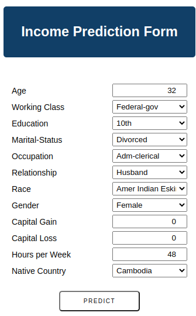
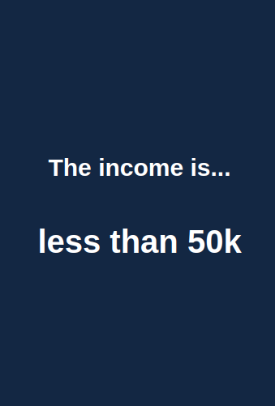

### Decision Trees and Random Forest in Python using scikit-learn

Projet using Random Forest concepts

- Income Prediction Form

- Income Prediction Result 

This is a experimental project using Random Forest and other models
in this case it uses notebooks from Kaggle replicated their notebooks in order to understand
the dataset analysis which is from "Adult Census Income"

you could download see the original and curated datasets:

- in Kaggle[https://www.kaggle.com/datasets/uciml/adult-census-income]
- in UCI[https://archive.ics.uci.edu/ml/datasets/adult], 

this dataset is about a United States population census in 1994 and it has
a target variable call "Income" which has two labels "more than 50K dollars" or "less than 50k dollars" that some person earns

There are 14 features about to economical, education and relationships statuses and other important feature call "fnlwgt" which is 
an statistical feature proposed by the census but this feature is very complicated to determined in a testing data, because it needs another
statistical parameters.

The notebooks that I based on to apply EDA is by Abhishek Negi [https://www.kaggle.com/code/abhi011097/eda-feature-engineering-logistic-regression] which help me to understand the interval of get a clean data

Then another notebook that I based on, It is by Sumit Mishra [https://www.kaggle.com/code/sumitm004/eda-and-income-predictions-87-36-accuracy]. It applied on LogisticRegression, RandomForest, Boosted Gradient Descent, BernoulliNB and SVC. The results show that Boosted Gradient Descente is appropriated model, but I choose Random Forest as a second model for experimental purposes.

Random Forest is an ensamble model because it uses many trees and use votes in order to get a mean result of every tree

Advantages:
- It works in a big datasets 
- Prevent Overfitting
- Tuning is better with the default parameters (deep tree, number of predictors)
- Stable with new samples 
- Use on classificacion an regression, depends on the weights

Disadvantages:
- Very expensive, more if you choose a big number of predictors (depends of your dataset size)
- It can't be applied on small datasets
- complex interpretation

You could see more here [Random_Forest](https://link.springer.com/article/10.1023/a:1010933404324)

Deploy a UI to predict using the random forest model

This is using:
- flask web framework
- railway (deployment)
- Example of deployment by geeksforgeeks[https://www.geeksforgeeks.org/deploy-machine-learning-model-using-flask/]

you could see the project here:
https://web-production-91f2.up.railway.app/

